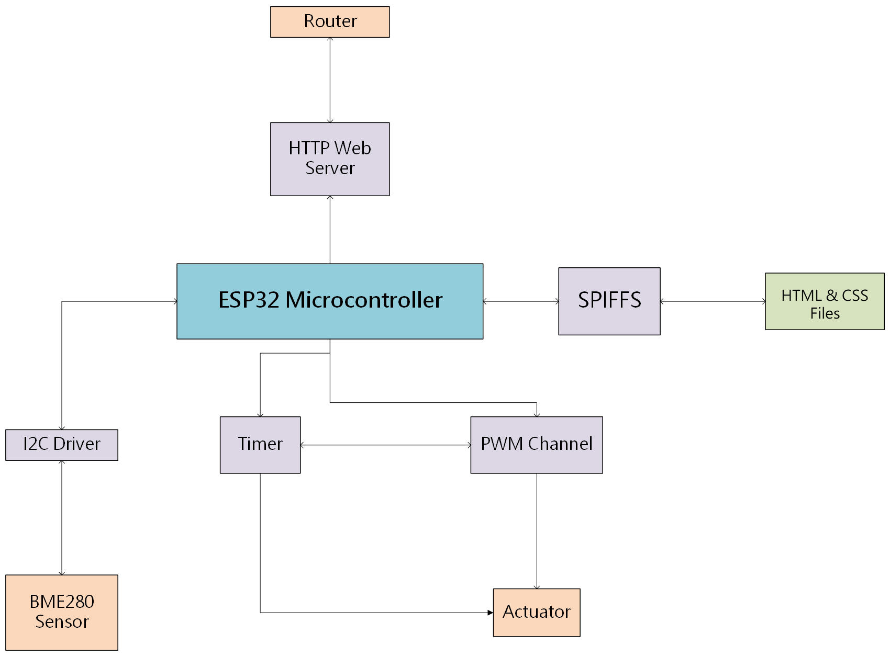

# Smart Light Project 💡
By Anindit Dewan

Last Updated: June 2025 

## Summary 📖
Welcome to my personal project using the ESP-IDF (Espressif Systems IoT Development Framework). 

This project is a smart light automation tool that allows users to control lights (whether it be an LED, or DC light bulb) using a web interface. There are various characteristics that the user can control about the lights such as allowing flickering, a certain brightness percentage they would like, timing the light to be on for certain intervals, and even adjusting the light based on the temperature in the room all from the comfort of their very own computer desk. 

## Skills & Technologies Used 🖥️
* Pulse Width Modulation (PWM) for controlling light brightness and flickering  
* Interrupt-driven timers for controlling time light will stay on
* Wi-Fi (IEEE 802.11) for creation of web server 
* I2C protocol for communication with temperature sensor (BME280) 
* SPIFFS (SPI Flash File System) for storing HTML & CSS pages into microcontroller flash memory   
* Git for version control
* FreeRTOS for managing ESP32 tasks 
* Breadboarding & wiring 

## Video Demonstration 🎥

## Block Diagram 👷

## User Installation ⚙️
1. Clone the github repository 
2. Ensure that ESP-IDF is installed on your computer, this can be done by by installing the extension on Visual Studio Code if on Windows. 
3. Open ESP-IDF terminal and enter `idf.py menuconfig` to open ESP-IDF configuration menu 
4. Go to Partition Table → Partition Table → Custom partition table CSV → write `partitions.csv` → Press "S" to save 
5. Then go to the front page → Serial flasher config → Flash size → 4+ MB → Press "S" to save 
6. Finally go back to the front page again → Component config → HTTPs Server → Set Max HTTP Header Request Length to `1024`
7. Escape/exit ESP-IDF configuration menu 
8. Enter `idf.py -p COMx flash monitor` to build, flash and open device monitor on the USB (`COMx`) port of your choice. 

 
## Things To Improve 🔨  
* UI of website 
* Integrate OLED display for temperature sensor 
* Simplify page loading code to be less repititive 